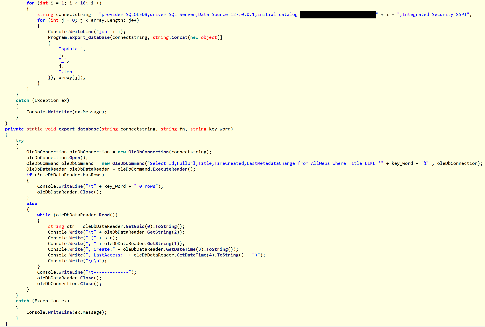

# Royal_APT
Royal APT - APT15 - Related Information from NCC Group Cyber Defense Operations Research

## Sharepoint tool

Among the tools developed by the group for the victim, APT15 created a .net tool to enumerate the victim's sharepoint database. Below is an screen-shot from the decompiled binary.

## Decoding scripts
Decoder scripts for BS2005 and RoyalCLI samples found by NCC Group can be found in the scripts directory. 

### BS2005
  `bs_decoder.py` will extract and decrypt commands included in html files sent to the sample `6ea9cc475d41ca07fa206eb84b10cf2bbd2392366890de5ae67241afa2f4269f`; namely `Alive.htm` and `Contents.htm`. It will also decode beacons sent to the C2.

Usage:

`bs2005_decoder.py html <htmlPath>/<htmlsDir>`

`bs2005_decoder.py beacon <beaconString>`

### RoyalCLI
`rcli_decoder.py` will decode RoyalCli config, RoyalCli html commands and the uris. 

Usage:

`royalcli_decoder.py html <htmlPath>/<htmlsDir>`

`royalcli_decoder.py cfg <configPath>`

`royalcli_decoder.py uri <beaconString>`
`

## Yara signatures
Yara signatures for the RoyalCLI, RoyalDNS and BS2005 samples found by NCC Group can be found in `apt15.yara` in the signatures folder.

## Suricata Signatures
Suricata signatures for RoyalCLI, RoyalDNS and BS2005 samples found by NCC Group can be found in `ids_signatures_apt15_royal.txt` in the signatures folder.
